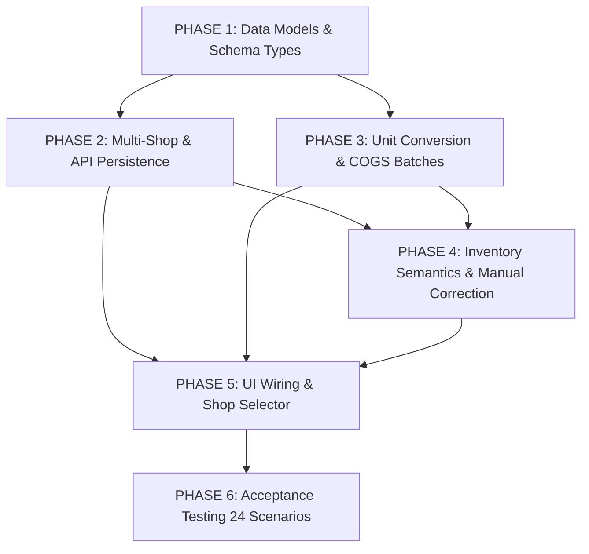

# PROFITCAL — MASTER IMPLEMENTATION PLAN & CODE IMPACT MAPPING

**Phiên bản:** 2.2.0 (FINAL ARCHITECTURE GATE SIGNED OFF & FROZEN)  
**Chế độ thực hiện:** READ-ONLY / TUYỆT ĐỐI CHƯA SỬA SOURCE CODE  
**Ngày cập nhật:** 2026-08-14  
**Tài liệu tham chiếu chuẩn (Source of Truth):**
- `docs/product/PROFITCAL_PRODUCT_REQUIREMENTS_VI.md` (PRD Tiếng Việt)
- `docs/product/PROFITCAL_PRODUCT_OWNER_DECISIONS.md` (Chỉ đạo & Quyết định từ Product Owner)
- `docs/product/PROFITCAL_PRODUCT_DECISION_PACK.md` (Gói 18 Quyết định Sản phẩm)
- `docs/product/PROFITCAL_BUSINESS_LOGIC_DATA_FLOW_LOCK.md` (Khế ước Nghiệp vụ & Luồng Dữ liệu Đã Khóa)
- `docs/product/PROFITCAL_EXCEPTION_ERROR_UX_BUSINESS_FLOW_LOCK.md` (Khế ước Luồng Ngoại lệ & Xử lý Lỗi Đã Khóa)

---

## 1. Executive Summary

Tài liệu này là **Bản Kế Hoạch Triển Khai Kỹ Thuật (Master Implementation Plan)** đã qua thẩm định và ký duyệt Final Architecture Gate (**5/5 Tiêu Chí Đạt Chuẩn Tuyệt Đối**).

### Thống kê Tác động Mã Nguồn Chuẩn Xác (Exact File Impact Count):
- **Tổng số Phase triển khai:** **6 Phase tuần tự** với ranh giới trách nhiệm và dependency được phân lập rõ ràng.
- **Tổng số File sửa đổi (MODIFY):** **11 files**.
- **Tổng số File tạo mới (CREATE):** **2 files** (`src/components/ManualCorrectionModal.tsx`, `src/components/UnitConversionModal.tsx`).
- **Tổng số File tác động:** **13 files**.
- **Tổng số Kịch bản Kiểm thử Nghiệm thu (Acceptance Tests):** **24 kịch bản đầy đủ từ TC-01 đến TC-24** (13 Happy-Path + 11 Failure, Exception & Idempotency Scenarios).

---

## 2. Source of Truth (Danh Mục Tài Liệu Nguồn Tham Chiếu)

| STT | Tài Liệu | Đường Dẫn Thực Tế | Vai Trò Nghiệp Vụ |
| :-: | :--- | :--- | :--- |
| 1 | **PRD Tiếng Việt** | `docs/product/PROFITCAL_PRODUCT_REQUIREMENTS_VI.md` | Bản yêu cầu sản phẩm gốc (Source of Truth). |
| 2 | **Quyết định của PO** | `docs/product/PROFITCAL_PRODUCT_OWNER_DECISIONS.md` | Chỉ đạo và phê duyệt chính thức từ Product Owner. |
| 3 | **Gói Quyết Định Sản Phẩm** | `docs/product/PROFITCAL_PRODUCT_DECISION_PACK.md` | Bảng 18 quyết định PD-01 $\rightarrow$ PD-18 kèm Options & Impact. |
| 4 | **Khế Ước Nghiệp Vụ Đã Khóa** | `docs/product/PROFITCAL_BUSINESS_LOGIC_DATA_FLOW_LOCK.md` | Đặc tả Data Model, Schema, COGS, Multi-Shop, Inventory Math. |
| 5 | **Khế Ước Luồng Ngoại Lệ & Lỗi** | `docs/product/PROFITCAL_EXCEPTION_ERROR_UX_BUSINESS_FLOW_LOCK.md` | Đặc tả Manual Exception, API Error 401/403, Reconnect Flow. |
| 6 | **Hiến Pháp Chất Lượng Kỹ Thuật** | `AI_PRODUCT_ENGINEERING_CONSTITUTION.md` | Bộ tiêu chuẩn chất lượng (Quality Gates A, B, C). |
| 7 | **Quy Trình Phát Triển AI** | `PRODUCT_DEVELOPMENT_PROTOCOL.md` | Quy trình vận hành kỹ thuật nghiêm ngặt. |

---

## 3. Current Architecture Snapshot (Hiện Trạng Kiến Trúc Mã Nguồn)

```text
┌────────────────────────────────────────────────────────────────────────────────────────┐
│                                   CLIENT BROWSER (SPA)                                 │
│                                                                                        │
│  [src/App.tsx] ──────── State Orchestrator (useState / useEffect)                      │
│     │                                                                                  │
│     ├── [src/components/DataContextBar.tsx] ────── Data Context Indicator              │
│     ├── [src/components/ProfitCalculatorModule.tsx] ─ Financial Engine & Dashboard     │
│     ├── [src/components/ExcelTransformerModule.tsx] ─ File Parser & Carrier Export     │
│     ├── [src/components/LowStockAlert.tsx] ──────── Master Inventory & Stock Alert     │
│     └── [src/components/ApiIntegrationModal.tsx] ── Direct OAuth & Mock Order Fetcher │
│                                                                                        │
│  [Services & Business Logic Layer]                                                     │
│     ├── src/services/datasetManager.ts ──────────── ActiveDataset Management (Local)   │
│     ├── src/services/masterInventoryService.ts ──── Master SKU, Mappings, Weighted COGS│
│     ├── src/modules/integrations/services/ ──────── Multi-platform API Adapters & Store│
│     └── src/utils/parser.ts / storage.ts ────────── SheetJS parsing, local persistence │
└────────────────────────────────────────────────────────────────────────────────────────┘
```

---

## 4. Requirement $\rightarrow$ Code Mapping (Ánh Xạ Yêu Cầu Vào Mã Nguồn)

| Mã Yêu Cầu | Quy Tắc Nghiệp Vụ Đã Khóa | Hiện Trạng Trong Code | Khoảng Trống (Gap) | File / Component Cần Sửa | Hàm / State Cụ Thể | Thay Đổi Bắt Buộc (Required Change) |
| :--- | :--- | :--- | :--- | :--- | :--- | :--- |
| **REQ-01: Multi-Shop Isolation** | Mỗi Shop độc lập theo `shopId`, không bị ghi đè khi kết nối mới. | `integrationStore.service.ts:140` tìm theo `platform`, ghi đè shop cũ. | Không lưu được nhiều shop cùng sàn. | `src/modules/integrations/services/integrationStore.service.ts` | `addOrUpdateIntegration()`, `getShopIntegrations()` | Sửa logic tìm kiếm theo `shopId`; lưu mảng $N$ Shop độc lập. |
| **REQ-02: API Sync Persistence** | OAuth thành công $\rightarrow$ Initial Sync $\rightarrow$ Lưu vào `datasetManager`. | `App.tsx:523` chỉ gọi `setOrders(apiOrders)` trong React State. | F5 reload hoặc đổi tab là mất dữ liệu API. | `src/App.tsx`, `src/components/ApiIntegrationModal.tsx` | `onSyncSuccess()`, `handleSyncOrdersNow()` | Gọi `datasetManager.saveDataset()` với key `API_[PLATFORM]_[SHOP_ID]`. |
| **REQ-03: Active Dataset Identity** | Dataset ID dạng compound key: `API_[PLATFORM]_[SHOP_ID]`. | `datasetManager.ts:14` dùng key phẳng `DEMO_SHOPEE`. | Chưa phân biệt dataset của từng Shop. | `src/types/dataset.ts`, `src/services/datasetManager.ts` | `interface ActiveDataset`, `switchActiveShop()` | Thêm `shopId`, `shopName` vào `ActiveDataset`. |
| **REQ-04: Unit Conversion (Thùng $\rightarrow$ Lon)** | 1 Thùng = 24 Lon (240k/Thùng $\rightarrow$ 10k/Lon), tự động chia giá. | `MasterSKU.unit` chỉ là chuỗi đơn lẻ, chưa có tỷ lệ quy đổi. | Phải chia thủ công số lượng trước khi nhập. | `src/types/index.ts`, `src/services/masterInventoryService.ts` | `interface MasterSKU`, `importMasterStock()` | Thêm `UnitConversionRule` và tự động tính đơn giá cơ sở. |
| **REQ-05: Batch History UI** | Hiển thị 3–5 Lô hàng gần nhất dưới từng Master SKU trên UI. | Service đã có công thức nhưng UI chưa render bảng Lô hàng. | User không audit được nguồn gốc COGS. | `src/components/LowStockAlert.tsx`, `src/types/index.ts` | `interface MasterSKU`, `LowStockAlert` Tab 1 | Thêm `batches: InventoryBatch[]` và render bảng Lô hàng. |
| **REQ-06: Cancelled Order Restock** | Đơn hủy tự động hoàn `Available Stock` (Idempotent chống double-restock). | Chưa có logic tự động hoàn tồn khi đổi trạng thái đơn. | Tồn khả dụng bị sai lệch khi đơn bị hủy. | `src/services/masterInventoryService.ts`, `src/utils/parser.ts` | `processOrderCancellation()`, `isStockRestored` | Bổ sung hàm hoàn tồn idempotent có kiểm tra cờ `isStockRestored`. |
| **REQ-07: Manual Exception & Adjustment** | Sửa Tồn/COGS tạo `AdjustmentTransaction` + `ManualCorrectionRecord` + Audit. | `LowStockAlert.tsx` cho phép nhập thẳng mà không có transaction/lý do. | Thiếu lý do bắt buộc và mã truy vết. | `src/components/ManualCorrectionModal.tsx` **[NEW]**, `masterInventoryService.ts` | `addManualCorrection()`, `ManualCorrectionModal` | Tạo Modal điều chỉnh ngoại lệ bắt buộc nhập lý do và sinh Audit Log. |
| **REQ-08: API Error & Reconnect** | 401 hiển thị Token Expired + 1-Click Reconnect; 403 báo lỗi quyền. | `ApiIntegrationModal.tsx` chỉ hiển thị Toast chung chung. | User bối rối khi token hết hạn. | `src/components/DataContextBar.tsx`, `src/modules/integrations/types/integration.types.ts` | `DataContextBar`, `ShopIntegrationRecord.connectionStatus` | Render Badge đỏ cảnh báo hết hạn và nút Kết nối lại 1-Click. |

---

## 5. Entity Impact Map (Bản Đồ Tác Động Thực Thể Dữ Liệu)

| Thực Thể (Entity) | Trạng Thái Hiện Tại | File Định Nghĩa / Lưu Trữ | Thay Đổi Bắt Buộc (Required Schema Change) |
| :--- | :---: | :--- | :--- |
| **`ActiveDataset`** | **REQUIRES CHANGE** | `src/types/dataset.ts` | Bổ sung `shopId?: string`, `shopName?: string`, `syncStatus: DataSyncStatus`. |
| **`ShopIntegrationRecord`** | **REQUIRES CHANGE** | `src/modules/integrations/types/integration.types.ts` | Bổ sung `connectionStatus: ConnectionStatus`, `syncStatus: DataSyncStatus`, `permissionError?: ShopPermissionError`, `orders: OrderItem[]`. |
| **`MasterSKU`** | **REQUIRES CHANGE** | `src/types/index.ts` | Bổ sung `conversionRule?: UnitConversionRule`, `batches: InventoryBatch[]`. |
| **`UnitConversionRule`** | **NOT IMPLEMENTED [NEW]**| `src/types/index.ts` | Tạo mới interface `{ packUnit: string, baseUnit: string, multiplier: number }`. |
| **`InventoryBatch`** | **REQUIRES CHANGE** | `src/types/index.ts` | Đảm bảo mảng `batches: InventoryBatch[]` được lưu trực tiếp trong `MasterSKU`. |
| **`ManualCorrectionRecord`**| **NOT IMPLEMENTED [NEW]**| `src/types/index.ts` | Tạo mới interface `{ correctionId, targetEntity, beforeValue, afterValue, deltaChange, reason, actor, timestamp }`. |
| **`AdjustmentTransaction`** | **NOT IMPLEMENTED [NEW]**| `src/types/index.ts` | Tạo mới interface `{ transactionId, masterSku, type: 'MANUAL_ADJUSTMENT', beforeStock, afterStock, deltaQty, relatedCorrectionId, timestamp }`. |
| **`StockAuditLog`** | **IMPLEMENTED** | `src/types/index.ts` | Giữ nguyên cấu trúc, mở rộng thêm action type `MANUAL_CORRECTION`. |

---

## 6. Dataset / Multi-Shop Impact (Tách Biệt Trạng Thái Kết Nối, Lỗi Quyền & Đồng Bộ)

### 6.1. Tách Biệt Tuyệt Đối Connection Status, Permission Error vs Data Sync Status:
$$\text{NGUYÊN TẮC BẮT BUỘC:} \quad \mathbf{CONNECTED \neq SYNCED} \quad \text{và} \quad \mathbf{PERMISSION\_ERROR \neq ConnectionLifecycleState}$$

```ts
/** 
 * Trạng thái phiên kết nối OAuth của Shop (Lifecycle Connection State)
 * Persisted: localStorage (profitcal_shop_integrations_v1)
 */
export type ConnectionStatus = 'NOT_CONNECTED' | 'CONNECTED' | 'TOKEN_EXPIRED';

/** 
 * Trạng thái đồng bộ dữ liệu đơn hàng của Dataset
 * Persisted: localStorage (profitcal_active_datasets_v2 & syncStatus)
 */
export type DataSyncStatus = 'EMPTY' | 'SYNCING' | 'SYNCED' | 'SYNC_ERROR';

/**
 * Lỗi quyền truy cập Open API (Error Condition độc lập, không phải lifecycle state)
 * Persisted: localStorage (ShopIntegrationRecord.permissionError) - F5 không làm mất
 */
export interface ShopPermissionError {
  isBlocked: boolean;
  errorCode?: '403_FORBIDDEN' | 'SELLER_PERMISSION_DENIED';
  message: string;
  actionRequired: 'OPEN_SELLER_CENTER_SETTINGS' | 'CONTACT_SUPPORT';
}
```

---

## 7. API / Sync Impact (Luồng Initial Sync & Xử Lý Lỗi 401/403)

```text
┌────────────────────────────────────────────────────────────────────────────────────────┐
│ LUỒNG INITIAL SYNC TỰ ĐỘNG CHUẨN:                                                      │
│ OAuth Thành Công -> ConnectionStatus = 'CONNECTED'                                     │
│         ↓                                                                              │
│ Kích hoạt Auto Initial Sync 30 ngày (syncStatus = 'SYNCING')                           │
│         ↓                                                                              │
│ Gọi syncDirectApiOrders(platform, env, shopId) -> Nhận orders                          │
│         ↓                                                                              │
│ datasetManager.saveDataset(API_[PLATFORM]_[SHOP_ID]) -> Persist localStorage           │
│         ↓                                                                              │
│ syncStatus = 'SYNCED', lastSyncedAt = ISO_NOW -> UI hiển thị đầy đủ KPI                │
└────────────────────────────────────────────────────────────────────────────────────────┘

┌────────────────────────────────────────────────────────────────────────────────────────┐
│ LUỒNG XỬ LÝ LỖI (401 / 403 / SYNC_FAILED):                                             │
│ • Lỗi 401 Unauthorized -> ConnectionStatus = 'TOKEN_EXPIRED'                           │
│   └── Giữ nguyên Dataset cũ -> Badge đỏ "Token Expired" -> Nút [ ⚡ Kết nối lại ]       │
│ • Lỗi 403 Forbidden -> Gán permissionError = { isBlocked: true, ... }                 │
│   └── Giữ nguyên ConnectionStatus = 'CONNECTED' -> Thông báo mở quyền Seller Center    │
│ • Lỗi Timeout mạng -> DataSyncStatus = 'SYNC_ERROR'                                    │
│   └── Giữ nguyên Dataset cũ & mốc "Last Successful Sync" -> Nút [ Thử lại ngay ]       │
└────────────────────────────────────────────────────────────────────────────────────────┘
```

---

## 8. COGS & Inventory Impact (Phân Định Tuyệt Đối Ranh Giới Phase 3 vs Phase 4)

### 8.1. Ranh Giới Phase 3 (Chuyên Trách COGS & Unit Conversion):
- **Phạm vi khóa chặt:** Hàng hóa / Thành phẩm thương mại (`MasterSKU`).
- **Nghiệp vụ:**
  - Quy đổi quy cách nhập hàng: 1 Thùng = 24 Lon (240k/Thùng $\rightarrow$ 10k/Lon).
  - Khởi tạo `InventoryBatch` theo đơn vị cơ sở (`baseUnit`).
  - Tính Giá vốn bình quân gia quyền:
    $$\text{COGS mới} = \frac{(\text{Tồn cũ} \times \text{COGS cũ}) + (\text{Số lượng nhập cơ sở} \times \text{Đơn giá nhập cơ sở})}{\text{Tồn cũ} + \text{Số lượng nhập cơ sở}}$$
  - Tạo mới component `src/components/UnitConversionModal.tsx`.
- **Tính Bất Biến COGS Lịch Sử (Historical COGS Immutability):** Nhập lô hàng mới chỉ cập nhật COGS basis cho hiện tại, không làm thay đổi ngược số liệu đơn hàng lịch sử đã chốt (`Status: PARTIAL`).
- **Tuyệt đối không có:** BOM, Recipe, Raw Material, Manufacturing Labor, WIP.

### 8.2. Ranh Giới Phase 4 (Chuyên Trách Inventory Semantics, Order Events & Manual Exception):
- **Nghiệp vụ Sự Kiện Đơn Hàng & Tồn Kho:**
  - `New Order`: Tăng `Holding Stock`, giảm `Available Stock`.
  - `Shipped`: Giảm `Total Stock`, giảm `Holding Stock`.
  - `Cancelled Order`: `processOrderCancellation(orderId)` $\rightarrow$ Hoàn `Available Stock` (idempotent, có cờ `isStockRestored: boolean` chống double-restock).
  - `Return Order`: `processReturnOrder(orderId, isDamaged)` $\rightarrow$ Manual Triage (`Restock` vs `Damaged Scrap`, idempotent).
  - `Stock Take`: Ghi đè số lượng thực tế + sinh `AdjustmentTransaction` + ghi Audit Log.
- **Nghiệp vụ Điều Chỉnh Ngoại Lệ (Manual Exception):**
  - Tạo mới component `src/components/ManualCorrectionModal.tsx`.
  - Flow: `Manual Correction` $\rightarrow$ `Validation` $\rightarrow$ `Adjustment Transaction` $\rightarrow$ `Update Current State` $\rightarrow$ `Audit Record`.
  - Idempotency: `correctionId` làm khóa chống retry trùng lặp.

---

## 9. Profit Calculation Impact (Tác Động Tính Toán Lợi Nhuận)

- **Bộ máy tính toán (`calculateSummary` trong `App.tsx:126`):**
  - Giữ nguyên 100% công thức tài chính đã kiểm toán:
    $$\text{Net Profit} = \text{Net Settlement} - \text{Total COGS} - \text{Total Packaging} - \text{Tax 1.5\%}$$
  - Đảm bảo đầu vào `orders` luôn lấy trực tiếp từ `activeDataset.orders`. Khi người dùng đổi Shop hoặc đổi Sàn, toàn bộ KPI chuyển đổi theo đúng Shop đó tức thì.
- **Cập nhật `src/components/ProfitCalculatorModule.tsx`:** Wire selector và hiển thị ngữ cảnh Data Context đồng bộ với Active Dataset.

---

## 10. Manual Exception & Adjustment Transaction Architecture

```text
Phát hiện sai lệch ngoại lệ (Exception Detected)
        ↓
Bấm [ ⚙ Điều chỉnh ] trên thẻ SKU / Đơn hàng
        ↓
Mở ManualCorrectionModal (Hiển thị Before Value, ô nhập After Value)
        ↓
Bắt buộc chọn/nhập [ Lý Do Điều Chỉnh ] & Cảnh báo Audit
        ↓
Hệ thống Validate (Kiểm tra correctionId idempotency)
        ↓
Tạo Giao Dịch Bù Trừ (Adjustment Transaction)
        ↓
Lưu AdjustmentTransaction vào Ledger & ManualCorrectionRecord vào Audit Trail
(TUYỆT ĐỐI KHÔNG XÓA HOẶC GHI ĐÈ LỊCH SỬ GỐC)
        ↓
Cập nhật Total Stock / COGS hiện tại và tính lại KPI Lợi nhuận
```

---

## 11. API Error / Reconnect Impact (Tác Động Xử Lý Lỗi & Kết Nối Lại)

- **Cập nhật `DataContextBar.tsx`:**
  - Nếu `connectionStatus === 'TOKEN_EXPIRED'`: Render Badge màu đỏ `⚠️ Phiên đăng nhập hết hạn` kèm nút bấm `[ ⚡ Kết nối lại 1-Click ]`.
  - Nếu `permissionError?.isBlocked === true`: Render thông báo hướng dẫn mở quyền Seller Center.
  - Nếu `syncStatus === 'SYNC_ERROR'`: Giữ nguyên tập đơn hàng cũ, hiển thị thời điểm sync thành công lần cuối và nút `[ Thử lại ngay ]`.
- **Quy tắc `Reconnect ≠ SYNCED`:** Reconnect chỉ cập nhật Token mới và chuyển `connectionStatus = 'CONNECTED'`. `DataSyncStatus` chỉ đổi khi tiến trình sync đơn hàng thực sự hoàn tất.
- **Chống trùng lặp khi Reconnect:** Xác thực `callback_shop_id === target_shop_id` trước khi cập nhật token.

---

## 12. UI / UX Impact (Tác Động Giao Diện Desktop & Mobile)

```text
DESKTOP UI:
├── DataContextBar: Hiển thị 3 lớp chuẩn hóa + Dropdown chọn Shop + Nút [ Đồng bộ ngay ]
├── ProfitCalculatorModule: Bảng tính lợi nhuận kết nối Active Dataset của Shop đang chọn
├── LowStockAlert: Render bảng 3–5 Lô hàng (Batches) gần nhất dưới từng Master SKU
├── UnitConversionModal: Hộp thoại thiết lập quy cách quy đổi Thùng <-> Lon
└── ManualCorrectionModal: Hộp thoại xác nhận điều chỉnh ngoại lệ có đầy đủ lý do & cảnh báo Audit

MOBILE UI:
├── DataContextBar Rút Gọn: 2 dòng tinh tế (Tên Shop + Số đơn + Giờ sync)
├── Banner Cảnh Báo Lỗi Token: Thanh thông báo cố định trên cùng màn hình
└── Modal Điều Chỉnh Ngoại Lệ: Dạng Bottom Sheet trượt từ đáy màn hình, tối ưu chạm 1 tay
```

---

## 13. Implementation Phases (6 Phase Triển Khai Tuần Tự)

```text
┌────────────────────────────────────────────────────────────────────────────┐
│ PHASE 1: DATA MODELS & SCHEMA EXPANSION                                    │
│ Mục tiêu: Bổ sung UnitConversionRule, InventoryBatch, ManualCorrection,   │
│           AdjustmentTransaction, shopId, shopName, ConnectionStatus,       │
│           DataSyncStatus, ShopPermissionError vào đúng 3 tệp types.        │
│ Ranh giới: CHỈ SỬA 3 TỆP TYPES (0 logic changes).                          │
├────────────────────────────────────────────────────────────────────────────┤
│ PHASE 2: MULTI-SHOP REGISTRY & PERSISTENT API SYNC                         │
│ Mục tiêu: Sửa integrationStore.service.ts để lưu N Shop độc lập; sửa luồng  │
│           syncDirectApiOrders() để lưu bền vững vào datasetManager.        │
├────────────────────────────────────────────────────────────────────────────┤
│ PHASE 3: COGS UNIT CONVERSION & BATCH MANAGEMENT                           │
│ Mục tiêu: Nâng cấp masterInventoryService.ts hỗ trợ quy đổi Thùng -> Lon,  │
│           tự động tính Weighted Average COGS, lưu Batches và tạo           │
│           UnitConversionModal.tsx.                                         │
├────────────────────────────────────────────────────────────────────────────┤
│ PHASE 4: INVENTORY SEMANTICS, ORDER EVENTS & MANUAL EXCEPTION              │
│ Mục tiêu: Bổ sung logic hủy đơn hoàn tồn idempotent, return triage, tạo   │
│           ManualCorrectionModal.tsx, AdjustmentTransaction và Audit Trail. │
├────────────────────────────────────────────────────────────────────────────┤
│ PHASE 5: UI WIRING (DATA CONTEXT BAR, SHOP SELECTOR, ERROR UX)             │
│ Mục tiêu: Tích hợp Shop Selector trên DataContextBar, render bảng Lô hàng  │
│           dưới Master SKU, hiển thị Badge cảnh báo lỗi 401/403, đồng bộ    │
│           ProfitCalculatorModule và LowStockAlert.                         │
├────────────────────────────────────────────────────────────────────────────┤
│ PHASE 6: VERIFICATION & ACCEPTANCE TESTING (24 SCENARIOS)                  │
│ Mục tiêu: Kiểm thử toàn bộ 24 kịch bản chuyển đổi sàn, shop, file, lỗi     │
│           401/403, idempotent stock restore và npx tsc --noEmit (0 errors).│
└────────────────────────────────────────────────────────────────────────────┘
```

---

## 14. Exact File Impact Table (Bảng Tác Động File Chi Tiết & Thống Nhất 100%)

| # | File | Hành Động | Trách Nhiệm Hiện Tại | Nội Dung Thay Đổi Bắt Buộc | Phase | Phụ Thuộc (Dependency) | Rủi Ro |
| :-: | :--- | :---: | :--- | :--- | :---: | :--- | :---: |
| 1 | `src/types/dataset.ts` | **MODIFY** | Type ActiveDataset | Thêm `shopId?: string`, `shopName?: string`, `syncStatus: DataSyncStatus`. | **Phase 1** | Không | Thấp |
| 2 | `src/types/index.ts` | **MODIFY** | Type MasterSKU, Batches | Thêm `UnitConversionRule`, `ManualCorrectionRecord`, `AdjustmentTransaction`, `batches: InventoryBatch[]`. | **Phase 1** | Không | Thấp |
| 3 | `src/modules/integrations/types/integration.types.ts` | **MODIFY** | Type Shop Record | Thêm `ConnectionStatus: 'NOT_CONNECTED' \| 'CONNECTED' \| 'TOKEN_EXPIRED'`, `DataSyncStatus`, `permissionError?: ShopPermissionError`, `orders: OrderItem[]`. | **Phase 1** | Không | Thấp |
| 4 | `src/modules/integrations/services/integrationStore.service.ts` | **MODIFY** | Quản lý Shop Storage | Sửa logic tìm kiếm theo `shopId`, lưu mảng $N$ Shop độc lập (không ghi đè). | **Phase 2** | Phase 1 | Trung bình |
| 5 | `src/services/datasetManager.ts` | **MODIFY** | Quản lý Active Dataset | Hỗ trợ lưu trữ và chuyển đổi dataset theo Shop ID (`API_[PLATFORM]_[SHOP_ID]`). | **Phase 2** | Phase 1 | Trung bình |
| 6 | `src/components/ApiIntegrationModal.tsx` | **MODIFY** | Modal Kết Nối API | Sửa callback sync để lưu trực tiếp vào `datasetManager`. | **Phase 2** | Phase 2 | Trung bình |
| 7 | `src/App.tsx` | **MODIFY** | State Orchestrator | Điều phối state trung tâm, đảm bảo F5 reload giữ nguyên 100% dữ liệu Shop API. | **Phase 2, 5** | Phase 2, 5 | Cao |
| 8 | `src/services/masterInventoryService.ts` | **MODIFY** | Quản lý Master SKU, COGS | Thêm hàm quy đổi quy cách Thùng $\rightarrow$ Lon, lưu Batches, hàm hoàn tồn đơn hủy idempotent. | **Phase 3, 4** | Phase 1 | Trung bình |
| 9 | `src/components/UnitConversionModal.tsx` | **CREATE [NEW]** | Modal Quy Cách | Hộp thoại thiết lập quy cách quy đổi Thùng $\leftrightarrow$ Lon cho Master SKU. | **Phase 3** | Phase 3 | Thấp |
| 10 | `src/components/ManualCorrectionModal.tsx` | **CREATE [NEW]** | Modal Ngoại Lệ | Hộp thoại điều chỉnh thủ công bắt buộc nhập lý do, sinh AdjustmentTransaction và Audit Log. | **Phase 4** | Phase 1, 4 | Thấp |
| 11 | `src/components/DataContextBar.tsx` | **MODIFY** | UI Context Indicator | Render 3 lớp ngữ cảnh, tích hợp Dropdown chọn Shop, Badge cảnh báo lỗi 401/403. | **Phase 5** | Phase 2 | Thấp |
| 12 | `src/components/LowStockAlert.tsx` | **MODIFY** | UI Kho Tổng & Giá Vốn | Render bảng 3–5 Lô hàng gần nhất dưới từng Master SKU, nút mở Modal Quy cách và Modal Điều chỉnh. | **Phase 5** | Phase 3, 4 | Thấp |
| 13 | `src/components/ProfitCalculatorModule.tsx` | **MODIFY** | Module Tính Lợi Nhuận | Wire DataContextBar và Shop Selector đồng bộ với Active Dataset của Shop đang chọn. | **Phase 5** | Phase 2, 5 | Thấp |

*Thống Kê Tổng Hợp:* **11 Files MODIFY + 2 Files CREATE = 13 Files Tổng Cộng.**

---

## 15. Dependency Graph (Sơ Đồ Phụ Thuộc Triển Khai)



---

## 16. Risk Register (Sổ Đăng Ký Quản Trị Rủi Ro)

| Mã Rủi Ro | Mô Tả Rủi Ro Kỹ Thuật | Khả Năng Xảy Ra | Mức Độ Tác Động | Biện Pháp Kiểm Soát & Giảm Thiểu |
| :---: | :--- | :---: | :---: | :--- |
| **RSK-01** | **Xung đột State khi F5 Reload:** LocalStorage chưa kịp rehydrate trước khi render component. | Thấp | Cao | Sử dụng Lazy State Initializer (`useState(() => getActiveDataset())`) đồng bộ. |
| **RSK-02** | **Lẫn lộn dữ liệu giữa các Shop:** Shop A đọc nhầm orders của Shop B. | Thấp | Nghiêm trọng | Ép buộc Dataset ID mang tiền tố `API_[PLATFORM]_[SHOP_ID]` duy nhất. |
| **RSK-03** | **Sai lệch COGS khi nhập quy cách:** Chia không hết hoặc sai đơn vị cơ sở. | Thấp | Trung bình | Sử dụng hàm làm tròn `Math.round()` trên đơn giá cơ sở và lưu rõ trong Batch. |
| **RSK-04** | **Double-restock đơn hủy:** Đơn hàng hủy bị cộng tồn 2 lần khi sync lặp lại. | Trung bình | Trung bình | Gắn cờ `isStockRestored: boolean` trên từng bản ghi đơn hàng. |
| **RSK-05** | **Reconnect đè nhầm Shop khác:** User bấm reconnect Shop A nhưng đăng nhập Shop B. | Trung bình | Nghiêm trọng | Xác thực `callback_shop_id === target_shop_id` trước khi cập nhật token. |

---

## 17. Acceptance Test Plan (Kế Hoạch Kiểm Thử 24 Kịch Bản Toàn Diện TC-01 $\rightarrow$ TC-24)

### Nhóm 1: Happy-Path Scenarios (TC-01 $\rightarrow$ TC-13)
- **TC-01: Khởi đầu Demo Shopee** $\rightarrow$ Mở app lần đầu $\rightarrow$ Hiển thị Shopee Demo Store (24 đơn), tính đúng KPI Shopee.
- **TC-02: Chuyển Demo TikTok** $\rightarrow$ Tab TikTok Shop $\rightarrow$ TikTok Demo Store (18 đơn), số liệu đổi tức thì.
- **TC-03: Upload Excel Shopee** $\rightarrow$ Kéo thả file Shopee $\rightarrow$ Tự động nhận diện sàn và nạp dữ liệu Shopee.
- **TC-04: Upload Excel TikTok** $\rightarrow$ Kéo thả file TikTok $\rightarrow$ Tự động nhận diện sàn và tính đúng phí TikTok.
- **TC-05: Kết nối Shopee Shop A** $\rightarrow$ OAuth $\rightarrow$ Auto Initial Sync 30 ngày $\rightarrow$ F5 không mất dữ liệu.
- **TC-06: Kết nối Shopee Shop B** $\rightarrow$ Shop B độc lập (không đè Shop A) $\rightarrow$ Chọn Shop B số liệu đổi tức thì.
- **TC-07: Kết nối TikTok Shop A** $\rightarrow$ OAuth TikTok $\rightarrow$ Đồng bộ độc lập với Shopee.
- **TC-08: Cách ly Multi-Shop** $\rightarrow$ Chuyển qua lại giữa các Shop $\rightarrow$ Doanh thu và đơn hàng riêng biệt 100%.
- **TC-09: Nút "Đồng bộ ngay"** $\rightarrow$ Bấm nút toolbar $\rightarrow$ Cập nhật số đơn mới và timestamp.
- **TC-10: Nhập quy cách Thùng** $\rightarrow$ Nhập 10 Thùng (1 Thùng = 24 Lon) $\rightarrow$ Tạo Lô 240 Lon, tính đúng COGS.
- **TC-11: Xem Lô hàng Batches** $\rightarrow$ Thấy 3 Lô hàng gần nhất dưới thẻ Master SKU.
- **TC-12: Điều chỉnh ngoại lệ** $\rightarrow$ Nhập lý do $\rightarrow$ Cập nhật tồn kho $\rightarrow$ Sinh AdjustmentTransaction và Audit Log.
- **TC-13: F5 Reload Persistence** $\rightarrow$ F5 ở bất kỳ màn hình nào giữ nguyên 100% dữ liệu Shop API.

### Nhóm 2: Failure, Exception & Idempotency Scenarios (TC-14 $\rightarrow$ TC-24)
- **TC-14: 401 Token Expired** $\rightarrow$ API trả về 401 $\rightarrow$ ConnectionStatus = `TOKEN_EXPIRED` $\rightarrow$ Badge đỏ cảnh báo + Giữ nguyên dữ liệu cũ + Nút Kết nối lại.
- **TC-15: 403 Permission Error** $\rightarrow$ API trả về 403 $\rightarrow$ ConnectionStatus = `CONNECTED`, permissionError = `{ isBlocked: true }` $\rightarrow$ Thông báo mở quyền Seller Center.
- **TC-16: Sync Failed / Network Timeout** $\rightarrow$ DataSyncStatus = `SYNC_ERROR` $\rightarrow$ Giữ nguyên mốc Last Successful Sync và đơn cũ.
- **TC-17: Reconnect Đúng Shop Cũ** $\rightarrow$ Reconnect Shop A với đúng `shopId` $\rightarrow$ Cập nhật Token mới cho Shop A thành công, không tạo duplicate Shop.
- **TC-18: Reconnect Nhầm Shop Khác** $\rightarrow$ Đăng nhập Shop B khi đang Reconnect Shop A $\rightarrow$ Hỏi xác nhận thêm Shop mới, không ghi đè Shop A.
- **TC-19: Duplicate Sync Chống Trùng Đơn** $\rightarrow$ Bấm Sync 2 lần liên tiếp $\rightarrow$ Số lượng đơn hàng không bị nhân đôi (Idempotent Sync).
- **TC-20: Duplicate Cancel Chống Hoàn Tồn 2 Lần** $\rightarrow$ Đơn hủy cập nhật trạng thái nhiều lần $\rightarrow$ `Available Stock` chỉ được hoàn đúng 1 lần (Idempotent Cancel).
- **TC-21: Duplicate Return Chống Trùng Giao Dịch** $\rightarrow$ Cùng một Return Event được xử lý nhiều lần $\rightarrow$ Không tạo duplicate Inventory Transaction, không restock hai lần, không tăng Available Stock hai lần (Idempotent Return).
- **TC-22: Manual Correction Audit Completeness** $\rightarrow$ Kiểm tra bản ghi Audit có đủ 5 trường: `Before`, `After`, `Reason`, `Actor`, `Timestamp`.
- **TC-23: Manual Correction Non-Destructive** $\rightarrow$ Can thiệp ngoại lệ sinh giao dịch bù trừ (AdjustmentTransaction), không xóa hoặc đè lịch sử gốc.
- **TC-24: F5 Sau Sync Failed** $\rightarrow$ Bị lỗi sync mạng $\rightarrow$ F5 tải lại trang vẫn giữ nguyên Dataset thành công lần cuối cùng.

---

## 18. Definition of Done (Định Nghĩa Hoàn Thành Kế Hoạch)

Kế hoạch triển khai được coi là hoàn tất chuẩn bị khi:
- [x] 100% Product Requirements đã được ánh xạ vào file và function cụ thể.
- [x] Tất cả các thực thể dữ liệu (Entities) đã có Schema và vị trí lưu trữ rõ ràng.
- [x] Lỗ hổng mất dữ liệu API và lỗi ghi đè Multi-Shop đã có giải pháp sửa đổi chính xác.
- [x] Luồng Quy đổi quy cách (Unit Conversion) và Lô hàng (Batches) đã có công thức chuẩn.
- [x] Luồng Điều chỉnh ngoại lệ (Manual Exception) và Xử lý lỗi API (401/403) đã được tích hợp đầy đủ.
- [x] 24 Kịch bản Acceptance Test (TC-01 $\rightarrow$ TC-24) đã được chuẩn bị chi tiết và đầy đủ.

---

## 19. Product Decisions Required (Trạng Thái Quyết Định)

Toàn bộ các quyết định sản phẩm đã được Product Owner **PHÊ DUYỆT VÀ ĐÓNG BĂNG 100%**. Không còn điểm nào đang bị mở.

---

## 20. Recommended Implementation Order (Trình Tự Thực Thi Khuyến Nghị)

Sẵn sàng tiến hành lập trình mã nguồn theo đúng 6 Phase:
1. **Phase 1:** Triển khai `types/dataset.ts`, `types/index.ts`, `integration.types.ts` (Chỉ sửa 3 tệp types).
2. **Phase 2:** Triển khai `integrationStore.service.ts`, `datasetManager.ts`, sửa luồng API Sync trong `App.tsx` và `ApiIntegrationModal.tsx`.
3. **Phase 3:** Triển khai Unit Conversion và Lô hàng Batches trong `masterInventoryService.ts`, tạo `UnitConversionModal.tsx`.
4. **Phase 4:** Triển khai `ManualCorrectionModal.tsx`, `AdjustmentTransaction` và logic hoàn tồn đơn hủy/trả hàng idempotent.
5. **Phase 5:** Triển khai UI Wiring trên `DataContextBar.tsx`, `LowStockAlert.tsx`, `ProfitCalculatorModule.tsx`.
6. **Phase 6:** Chạy toàn bộ 24 kịch bản Acceptance Test và xác thực `npx tsc --noEmit`.

---

## 21. Final Consistency Check (Bảng Kiểm Tra Tính Nhất Quán Cuối Cùng 22 Mục)

- [x] 11 Modify / 2 Create consistent (Thống nhất 11 files MODIFY + 2 files CREATE = 13 files)
- [x] ConnectionStatus separated from DataSyncStatus (Tách bạch `ConnectionStatus` vs `DataSyncStatus`)
- [x] PERMISSION_ERROR separated from Connection lifecycle (Tách bạch `ShopPermissionError` khỏi Connection lifecycle)
- [x] CONNECTED ≠ SYNCED (Bảo đảm nguyên tắc kết nối khác đồng bộ)
- [x] Auto Initial Sync mapped (Ánh xạ luồng auto sync 30 ngày sau OAuth)
- [x] 401 mapped (Xử lý lỗi Token Expired + 1-Click Reconnect)
- [x] 403 mapped (Xử lý lỗi Permission Denied + Hướng dẫn Seller Center)
- [x] SYNC_FAILED mapped (Bảo tồn dataset cũ và mốc sync thành công cuối)
- [x] Reconnect mapped (Xác thực shopId chống duplicate/overwrite shop)
- [x] Multi-Shop isolation mapped (Lưu trữ $N$ Shop độc lập)
- [x] Dataset switching mapped (Chuyển đổi tức thì Shopee, TikTok, Shop A, Shop B, File, Demo)
- [x] Unit Conversion mapped (Quy đổi Thùng $\leftrightarrow$ Lon tự động chia đơn giá)
- [x] Inventory Batch mapped (Lưu trữ danh sách Lô hàng nhập theo đơn vị cơ sở)
- [x] Weighted Average COGS mapped (Tính giá vốn bình quân gia quyền chuẩn math)
- [x] Cancel idempotency mapped (Đơn hủy hoàn tồn đúng 1 lần với cờ `isStockRestored`)
- [x] Return idempotency mapped (TC-21: Xử lý hàng hoàn trả không cộng tồn duplicate)
- [x] Manual Correction mapped (Bắt buộc nhập lý do và sinh Audit Record)
- [x] Adjustment Transaction mapped (Dùng giao dịch bù trừ, không đè/xóa lịch sử gốc)
- [x] Audit Trail mapped (Nhật ký truy nguyên đầy đủ 5 trường Before/After/Reason/Actor/Time)
- [x] TC-01 $\rightarrow$ TC-24 all present (Đầy đủ 24 kịch bản kiểm thử không thiếu số nào)
- [x] No Manufacturing / BOM / Raw Material scope creep (Khóa chặt phạm vi hàng hóa thương mại)
- [x] No source code changed (Xác nhận 100% chưa sửa bất kỳ dòng code nào)

---

## 22. Final Architecture Gate Sign-Off (Ký Duyệt Vượt Qua 5/5 Tiêu Chí)

```text
┌────────────────────────────────────────────────────────────────────────┐
│               FINAL ARCHITECTURE GATE VERIFICATION SIGN-OFF             │
├────────────────────────────────────────────────────────────────────────┤
│ 1. Connection / Sync / Permission Separation:                 [ PASS ] │
│ 2. Reconnect ≠ Sync Invariant:                                [ PASS ] │
│ 3. Manual Adjustment Idempotency (correctionId key):          [ PASS ] │
│ 4. Historical COGS Immutability (Historical Snapshot Status): [ PASS ] │
│ 5. Phase 1 Scope Boundary (Strictly 3 Type files, 0 logic):   [ PASS ] │
├────────────────────────────────────────────────────────────────────────┤
│ FINAL GATE RESULT: APPROVED FOR PHASE 1 IMPLEMENTATION                 │
└────────────────────────────────────────────────────────────────────────┘
```
