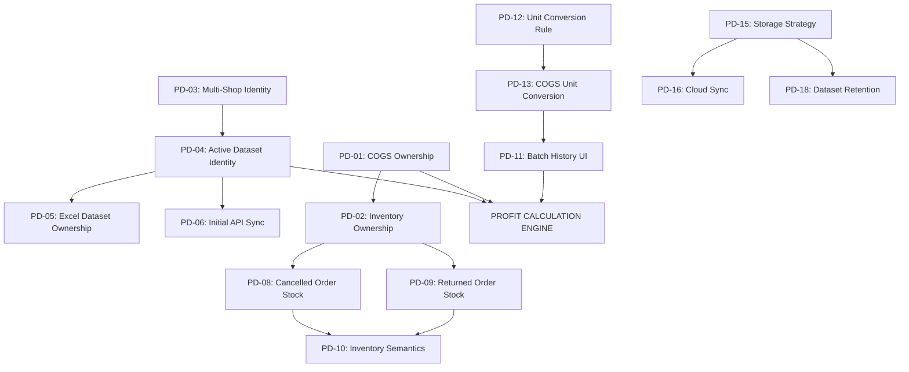

# PROFITCAL PRODUCT DECISION PACK

**Phiên bản:** 1.0.0  
**Chế độ thực hiện:** READ-ONLY / KHÔNG THAY ĐỔI MÃ NGUỒN  
**Trạng thái:** DRAFT — FOR PRODUCT OWNER DECISION LOCK  
**Mục tiêu:** Cung cấp đầy đủ cơ sở phân tích, hiện trạng thực tế trong code, các phương án lựa chọn (Options), khuyến nghị kỹ thuật (RECOMMENDATION — NOT LOCKED) và tác động nghiệp vụ để Product Owner khóa toàn bộ Business Rules và Data Flow trước khi tiến hành Implementation.

---

## 1. Purpose (Mục Đích)

Tài liệu này là gói quyết định sản phẩm tập trung (**Product Decision Pack**) dành cho Product Owner nhằm:
1. Xác định và đóng băng toàn bộ 18+ quyết định nghiệp vụ còn đang mở hoặc đang bị đứt gãy trong luồng dữ liệu hiện tại.
2. Thiết lập tính toàn vẹn của chuỗi dữ liệu kinh doanh:
   $$\text{User} \rightarrow \text{Platform} \rightarrow \text{Shop} \rightarrow \text{Data Source} \rightarrow \text{Dataset} \rightarrow \text{Orders} \rightarrow \text{SKU Mapping} \rightarrow \text{Master Inventory} \rightarrow \text{COGS Batches} \rightarrow \text{Profit Calculation}$$
3. Ngăn ngừa việc lập trình viên tự ý suy diễn hoặc tự ý mở rộng phạm vi sản phẩm ngoài mong muốn của Product Owner.

---

## 2. Source Documents (Tài Liệu Nguồn Tham Chiếu)

Tài liệu này được tổng hợp và đối chiếu trực tiếp từ 3 tài liệu cơ sở:
1. **[`PROFITCAL_PRODUCT_REQUIREMENTS_VI.md`](file:///Users/thiemvv/Documents/OnlineShop01/PROFITCAL_PRODUCT_REQUIREMENTS_VI.md):** Bản Yêu cầu Sản phẩm Chuẩn mực (Product Requirement Source of Truth).
2. **[`docs/audit/PROFITCAL_PRODUCT_REQUIREMENT_GAP_AUDIT.md`](file:///Users/thiemvv/Documents/OnlineShop01/docs/audit/PROFITCAL_PRODUCT_REQUIREMENT_GAP_AUDIT.md):** Báo cáo Kiểm toán Khoảng cách Yêu cầu (Gap Audit).
3. **[`docs/audit/PROFITCAL_BUSINESS_FLOW_PREPARATION.md`](file:///Users/thiemvv/Documents/OnlineShop01/docs/audit/PROFITCAL_BUSINESS_FLOW_PREPARATION.md):** Báo cáo Phân tích Luồng Nghiệp vụ & Thực thể (Business Flow Preparation).

---

## 3. Product Decision Master Table (Bảng Quyết Định Sản Phẩm Tổng Thể)

| ID | Quyết Định Nghiệp Vụ (Decision) | Hiện Trạng Code (Current State) | Câu Hỏi Nghiệp Vụ (Business Question) | Các Phương Án Lựa Chọn (Options) | Khuyến Nghị Kỹ Thuật (RECOMMENDATION — NOT LOCKED) | Quyết Định Của Product Owner (PO Decision) | Tác Động Nghiệp Vụ & Kỹ Thuật (Impact) |
| :-: | :--- | :--- | :--- | :--- | :--- | :---: | :--- |
| **PD-01** | **COGS Ownership (Quyền sở hữu COGS)** | Toàn cục theo Master SKU (`masterInventoryService.ts:16`) | Giá vốn COGS là thuộc tính chung của Master SKU (kho tổng) hay mỗi Shop có quyền có giá vốn riêng? | **A.** Toàn cục theo Master SKU.<br>**B.** Phân tách theo từng Shop.<br>**C.** Mặc định Master SKU, cho phép override theo Shop. | **Khuyến nghị Phương án A (Global Master SKU):** Đúng bản chất kho hàng thực tế của SME bán đa sàn. | *Chờ PO khóa* | Ảnh hưởng trực tiếp đến Data Model `MasterSKU` và công thức tính chi phí `OrderItem.cogs`. |
| **PD-02** | **Inventory Ownership (Quyền sở hữu Tồn kho)** | Kho tổng dùng chung (`masterInventoryService.ts:10`) | Tồn kho là kho vật lý dùng chung cho tất cả các gian hàng hay mỗi Shop quản lý một kho riêng? | **A.** Kho tổng dùng chung (Global Shared Inventory).<br>**B.** Tồn kho phân bổ riêng theo từng Shop.<br>**C.** Quản lý theo nhiều Kho vật lý (Multi-Warehouse). | **Khuyến nghị Phương án A (Global Shared Inventory):** Tránh tồn kho ảo và phù hợp scope hiện tại. | *Chờ PO khóa* | Ảnh hưởng đến logic trừ tồn kho khi đơn hàng phát sinh từ Shopee hoặc TikTok Shop. |
| **PD-03** | **Multi-Shop Identity (Định danh Đa Gian Hàng)** | 1 Shop/Sàn, bị ghi đè khi kết nối mới (`integrationStore.service.ts:40`) | Hệ thống có cho phép 1 user quản lý $N$ Shop Shopee và $N$ Shop TikTok độc lập không? | **A.** Cho phép kết nối $N$ Shop, phân biệt bằng `shopId` và `shopName`.<br>**B.** Giới hạn cố định 1 Shop cho Shopee và 1 Shop cho TikTok. | **Khuyến nghị Phương án A (Multi-Shop Registry):** Hỗ trợ người bán có nhiều gian hàng. | *Chờ PO khóa* | Cần thay đổi cấu trúc `ShopIntegrationRecord[]` thành mảng danh sách động. |
| **PD-04** | **Active Dataset Identity (Định danh Dataset Đang Dùng)** | Chuỗi phẳng `DEMO_SHOPEE`, `FILE_SHOPEE` (`datasetManager.ts:14`) | Cấu trúc định danh của một Dataset đang tính toán cần chứa những thông tin gì? | **A.** Compound Key: `[SOURCE]_[PLATFORM]_[SHOP_ID/FILE_ID]`.<br>**B.** Giữ nguyên chuỗi phẳng không chứa Shop ID. | **Khuyến nghị Phương án A:** Đảm bảo 100% không bao giờ bị lẫn lộn dữ liệu giữa các Shop. | *Chờ PO khóa* | Giúp hệ thống phân lập chính xác dữ liệu của từng Shop khi tính toán lợi nhuận. |
| **PD-05** | **Excel Dataset Ownership (Phạm vi Dataset Excel)** | Lưu 1 file active gần nhất cho mỗi sàn (`datasetManager.ts:182`) | File Excel upload lên được gắn theo Sàn chung hay gắn theo Shop cụ thể? | **A.** Gắn theo Sàn (`FILE_SHOPEE`, `FILE_TIKTOK`) kèm tên file và giờ upload.<br>**B.** Bắt buộc user chọn Shop trước khi upload file. | **Khuyến nghị Phương án A:** Linh hoạt cho seller chưa kết nối API mà chỉ kiểm toán file. | *Chờ PO khóa* | Đơn giản hóa trải nghiệm người dùng khi kiểm toán báo cáo định kỳ. |
| **PD-06** | **Initial API Sync (Đồng bộ lần đầu khi kết nối)** | Bắt buộc bấm thủ công ("Đồng bộ ngay" trong modal) | Sau khi OAuth thành công, hệ thống có tự động tải 30 ngày đơn gần nhất không? | **A.** Tự động tải 30 ngày đơn ngay sau khi OAuth thành công.<br>**B.** Chỉ tải khi user chủ động bấm "Đồng bộ ngay".<br>**C.** Tự động tải lần đầu + hỗ trợ bấm sync thủ công. | **Khuyến nghị Phương án C (Auto First Sync + Manual Re-sync):** Trải nghiệm mượt mà và chủ động. | *Chờ PO khóa* | Người dùng kết nối xong là có ngay số liệu trên màn hình mà không cần đoán. |
| **PD-07** | **Token Expiry Behavior (Xử lý khi Token hết hạn)** | Gán status `TOKEN_EXPIRED` (`integration.types.ts:5`) | Khi token sàn hết hạn sau 30–90 ngày, hệ thống phản hồi thế nào? | **A.** Hiển thị Badge đỏ "Token hết hạn" kèm nút "Kết nối lại 1-Click".<br>**B.** Tự động gọi endpoint Refresh Token ngầm.<br>**C.** Khóa toàn bộ màn hình yêu cầu đăng nhập lại. | **Khuyến nghị Phương án A kết hợp B (Tự refresh ngầm, nếu fail thì hiện 1-Click Reconnect).** | *Chờ PO khóa* | Đảm bảo tính liên tục của dữ liệu và an toàn bảo mật. |
| **PD-08** | **Cancelled Order $\rightarrow$ Inventory (Đơn hủy hoàn tồn)** | Chưa có hàm tự động hoàn tồn (`parser.ts:138`) | Đơn hàng trạng thái `cancelled` có tự động hoàn trả số lượng vào `Available Stock` không? | **A.** Tự động hoàn trả số lượng vào `Available Stock`.<br>**B.** Không tự động hoàn trả, giữ nguyên để user tự kiểm kho. | **Khuyến nghị Phương án A:** Phản ánh đúng số lượng thực tế có thể bán tiếp. | *Chờ PO khóa* | Tránh báo động hết hàng ảo khi đơn hàng đã bị hủy trước khi giao. |
| **PD-09** | **Returned Order $\rightarrow$ Inventory (Đơn hoàn trả kho)** | Modal thủ công phân loại 2 nút (`masterInventoryService.ts:265`) | Hàng hoàn trả (Return) xử lý kho như thế nào? | **A.** Giữ modal phân loại thủ công `[ Tái nhập kho ]` vs `[ Báo phế / Hàng hỏng ]`.<br>**B.** Tự động tái nhập kho tất cả đơn hoàn. | **Khuyến nghị Phương án A:** Hàng hoàn TMĐT thường có tỷ lệ móp vỡ/hỏng, bắt buộc kiểm tra thực tế. | *Chờ PO khóa* | Ngăn ngừa việc cộng lại hàng hỏng vào tồn kho bán được. |
| **PD-10** | **Inventory Transaction Semantics (Ngữ nghĩa biến động kho)** | Mảng log lịch sử `StockAuditLog[]` (`masterInventoryService.ts:141`) | Lưu trữ biến động tồn kho dưới dạng Event Log hay Double-Entry Ledger? | **A.** Append-only Event Log (`IMPORT`, `SALE`, `RETURN`, `ADJUSTMENT`).<br>**B.** Strict Double-Entry Ledger (Sổ cái kế toán kép). | **Khuyến nghị Phương án A:** Nhẹ, nhanh, đáp ứng 100% nhu cầu truy vết kho của SME. | *Chờ PO khóa* | Không làm phức tạp hóa hệ thống quá mức cần thiết. |
| **PD-11** | **Batch History UI Scope (Phạm vi hiển thị Lô hàng)** | Chỉ có Audit Log chung trong Tab 4 (`LowStockAlert.tsx:372`) | Danh sách Lô hàng nhập (`Lô #001: 50 × 130k`...) hiển thị ở đâu trên UI? | **A.** Hiển thị 3 Lô gần nhất ngay dưới thẻ SKU kèm nút "Xem tất cả".<br>**B.** Chỉ hiển thị trong Modal chi tiết giá vốn khi bấm vào SKU.<br>**C.** Chỉ hiển thị trong một Tab riêng biệt "Quản lý Lô hàng". | **Khuyến nghị Phương án A:** Trực quan, người dùng nhìn thấy ngay nguồn gốc hình thành COGS. | *Chờ PO khóa* | Tăng tính minh bạch tài chính cho giá vốn bình quân gia quyền. |
| **PD-12** | **Unit / Conversion Rule (Quy tắc quy đổi quy cách)** | `MasterSKU.unit` dạng chuỗi đơn lẻ (`types/index.ts:10`) | Quy tắc quy đổi quy cách (VD: 1 Thùng = 24 Lon) thuộc về thực thể nào? | **A.** Gắn trực tiếp vào `MasterSKU` (`baseUnit`, `packUnit`, `conversionRatio`).<br>**B.** Quản lý thành một bảng Conversion Registry riêng biệt.<br>**C.** Chỉ xử lý qua Multiplier của `SkuMapping`. | **Khuyến nghị Phương án A:** Đơn giản, trực quan, gắn liền với từng sản phẩm cụ thể. | *Chờ PO khóa* | Cho phép nhập hàng theo Thùng nhưng bán và tính tồn theo Lon/Cái. |
| **PD-13** | **COGS + Unit Conversion (Giá vốn theo quy cách nhập)** | Tính trực tiếp theo đơn vị cơ sở (`masterInventoryService.ts:227`) | Khi nhập hàng theo Thùng (VD: 1 Thùng giá 240.000đ = 24 Lon), COGS Lô được tính thế nào? | **A.** Hệ thống tự động quy đổi: $\text{Giá nhập/đơn vị} = 240.000 / 24 = 10.000đ$ và tạo Batch 24 Lon.<br>**B.** Bắt buộc user tự chia thủ công trước khi nhập. | **Khuyến nghị Phương án A:** Giảm sai sót tính toán cho nhân viên kho. | *Chờ PO khóa* | Tự động hóa tính toán giá vốn bình quân gia quyền theo đơn vị bán lẻ. |
| **PD-14** | **Fee Anomaly Threshold (Ngưỡng cảnh báo phí sàn)** | Tĩnh 15% toàn hệ thống (`storage.ts:15`) | Ngưỡng cảnh báo phí sàn cao là cố định hay cho phép tùy chỉnh? | **A.** Mặc định 15%, cho phép chỉnh trong Cài đặt (`settings.feeThreshold`).<br>**B.** Cho phép cài đặt ngưỡng riêng biệt cho Shopee (VD: 14%) và TikTok (VD: 12%). | **Khuyến nghị Phương án A:** Đơn giản, dễ hiểu và đã được cài đặt sẵn. | *Chờ PO khóa* | Phát hiện kịp thời các đơn hàng bị trừ phí dịch vụ hoặc marketing bất thường. |
| **PD-15** | **Storage Strategy (Chiến lược lưu trữ dữ liệu)** | `localStorage` trình duyệt (`storage.ts:1-190`) | Chiến lược lưu trữ dữ liệu trong giai đoạn (Phase) hiện tại là gì? | **A.** Local-First / Browser-First (`localStorage` + `datasetManager`).<br>**B.** Cloud Database Sync (Supabase PostgreSQL) ngay lập tức.<br>**C.** Hybrid (Local-first cho Guest, Cloud Sync khi Đăng nhập). | **Khuyến nghị Phương án A cho Phase Logic hiện tại, chuẩn bị Schema cho C.** | *Chờ PO khóa* | Giữ vững tiến độ ổn định logic kinh doanh mà không bị nghẽn bởi hạ tầng mạng. |
| **PD-16** | **Cloud / Multi-Device Sync (Đồng bộ đa thiết bị)** | Chưa hỗ trợ (`localStorage` cục bộ) | Có hỗ trợ đồng bộ dữ liệu giữa Laptop và Điện thoại trong Phase này không? | **A.** Tạm hoãn sang Phase Cloud Sync tiếp theo (Tập trung hoàn thiện Desktop/Mobile UI trên 1 máy).<br>**B.** Triển khai đồng bộ Backend Realtime ngay lập tức. | **Khuyến nghị Phương án A:** Tuân thủ đúng phân kỳ phát triển sản phẩm. | *Chờ PO khóa* | Đảm bảo sản phẩm chạy hoàn hảo trên từng thiết bị trước khi làm đồng bộ đám mây. |
| **PD-17** | **Subscription & Billing Gating (Cơ chế phân quyền gói cước)** | Client-side `user.tokens` và `user.tier` (`storage.ts:81`) | Giới hạn tính năng giữa Free và PRO được thiết lập như thế nào? | **A.** Free: 20 tokens kiểm toán/tuần, tối đa 1 Shop; PRO: Không giới hạn tokens & Shop.<br>**B.** Free: Đầy đủ tính năng tính toán, chỉ giới hạn xuất file vận chuyển.<br>**C.** Mở toàn bộ tính năng trong giai đoạn Beta/Launch. | **Khuyến nghị Phương án A:** Khuyến khích người dùng nâng cấp gói PRO sau khi dùng thử. | *Chờ PO khóa* | Định hình mô hình kinh doanh Freemium của SaaS. |
| **PD-18** | **Dataset Retention & Persistence (Thời gian lưu giữ dữ liệu)** | Lưu vĩnh viễn trong `localStorage` đến khi user xóa | Dữ liệu tính toán của từng Shop được lưu giữ trong bao lâu? | **A.** Lưu vĩnh viễn dataset active gần nhất của từng Shop trên trình duyệt.<br>**B.** Tự động xóa sau 30 ngày nếu không có tương tác.<br>**C.** Cho phép user bấm nút "Xóa dữ liệu / Đặt lại về mặc định". | **Khuyến nghị Phương án A kết hợp C (Lưu vĩnh viễn + có nút Reset sạch sẽ).** | *Chờ PO khóa* | Đảm bảo người dùng mở lại app là thấy ngay số liệu của lần làm việc trước. |

---

## 4. COGS Decisions (Quyết Định Chi Tiết Về Giá Vốn)

### 4.1. Khóa Chặt Phạm Vi Sản Phẩm (Scope Boundary)
- **IN-SCOPE (Phạm vi bắt buộc):** Hàng hóa / Thành phẩm thương mại mua đi bán lại $\rightarrow$ Nhập kho $\rightarrow$ Quản lý theo SKU $\rightarrow$ Quy cách đóng gói / Multiplier $\rightarrow$ Lô hàng (Batches) $\rightarrow$ Giá vốn bình quân gia quyền (Weighted Average COGS).
- **OUT-OF-SCOPE (Tuyệt đối không đưa vào):** Quy trình sản xuất chế biến, Định mức nguyên vật liệu (BOM), Công thức (Recipe), Lệnh sản xuất (Production Order), Bán thành phẩm (WIP), Hao hụt sản xuất (Yield/Loss), Chi phí nhân công sản xuất (Manufacturing Labor).

### 4.2. Phân Tích PD-12: Vị Trí Lưu Trữ Quy Tắc Quy Đổi (Unit Conversion Rule)
*Ví dụ:* Nhập `1 Thùng Bia = 24 Lon` $\rightarrow$ Bán lẻ theo `Lon` $\rightarrow$ Bán Combo `Combo 6 Lon`.

```text
CÁC PHƯƠNG ÁN THIẾT KẾ DATA MODEL:

Phương án A (Khuyến nghị — Gắn trực tiếp vào MasterSKU):
MasterSKU {
  masterSku: 'LON-BIA-01',
  productName: 'Bia Lon Saigon 330ml',
  baseUnit: 'Lon',          // Đơn vị cơ sở để tính tồn kho và bán lẻ
  packUnit: 'Thùng',        // Đơn vị quy cách khi nhập hàng
  packMultiplier: 24,       // 1 Thùng = 24 Lon
  cogsPrice: 10000,         // Giá vốn bình quân trên 1 Lon (baseUnit)
  totalStock: 240           // 240 Lon (= 10 Thùng)
}

Phương án B (Tách bảng UnitConversion riêng):
UnitConversion { id: 'uc_1', masterSku: 'LON-BIA-01', fromUnit: 'Thùng', toUnit: 'Lon', ratio: 24 }
```
- **Khuyến nghị Kỹ thuật (NOT LOCKED):** Chọn **Phương án A** vì cấu trúc gọn nhẹ, dễ hiển thị trên UI nhập kho, không cần join bảng phức tạp trong môi trường Local-First.

### 4.3. Phân Tích PD-13: Luồng Tính COGS Khi Nhập Hàng Theo Quy Cách
```text
Bước 1: Nhân viên nhập hàng: Chọn SKU 'LON-BIA-01' -> Chọn đơn vị nhập 'Thùng'
Bước 2: Nhập số lượng: 10 Thùng, Tổng tiền thanh toán: 2.400.000đ (Đơn giá 240.000đ/Thùng)
Bước 3: Hệ thống tự động quy đổi:
        - Số lượng đơn vị cơ sở = 10 x 24 = 240 Lon
        - Giá nhập cơ sở = 2.400.000 / 240 = 10.000đ/Lon
Bước 4: Tạo Lô hàng mới (InventoryBatch): "Lô #002" (240 Lon x 10.000đ)
Bước 5: Tính Giá vốn bình quân gia quyền mới (Weighted Average COGS):
        COGS_mới = (Tồn_cũ x COGS_cũ + 240 x 10.000) / (Tồn_cũ + 240)
Bước 6: Gán COGS_mới vào MasterSKU -> Tự động cập nhật cho các đơn hàng bán lẻ và Combo.
```

---

## 5. Shop / Dataset Decisions (Quyết Định Về Gian Hàng & Tập Dữ Liệu)

### 5.1. Chuỗi Ngữ Cảnh Dữ Liệu Đơn Hướng (Single Source of Truth Chain)
$$\text{USER} \rightarrow \text{PLATFORM} \rightarrow \text{SHOP} \rightarrow \text{DATA SOURCE} \rightarrow \text{DATASET} \rightarrow \text{ORDERS} \rightarrow \text{SKU} \rightarrow \text{COGS} \rightarrow \text{INVENTORY} \rightarrow \text{PROFIT}$$

```text
┌────────────────────────────────────────────────────────────────────────────────────────┐
│ USER (Tài khoản người dùng: user@tagki.com)                                            │
│  └── ACTIVE PLATFORM: Shopee                                                           │
│       └── ACTIVE SHOP: "Gian Hàng Shopee Mall Chính Thức" (shop_id: '98765432')        │
│            └── DATA SOURCE: API                                                        │
│                 └── ACTIVE DATASET: 'API_SHOPEE_98765432'                              │
│                      ├── Trạng thái: SYNCED (Đồng bộ lúc 15:28)                        │
│                      ├── Số lượng: 128 đơn hàng                                        │
│                      └── ORDERS LIST: OrderItem[]                                      │
│                           └── TÍNH TOÁN LỢI NHUẬN: Doanh thu, Phí sàn, Thuế, Lãi Ròng   │
└────────────────────────────────────────────────────────────────────────────────────────┘
```

### 5.2. Trả Lời 7 Câu Hỏi Trọng Yếu Của Kiến Trúc Shop & Dataset:
1. **Shop có phải Business Entity độc lập không?** $\rightarrow$ **CÓ.** Mỗi Shop có `shopId`, `shopName`, `platform`, `environment`, và `accessToken` riêng biệt.
2. **Một user có nhiều Shop cùng Platform không?** $\rightarrow$ **CÓ.** Hỗ trợ user sở hữu đồng thời Shop A, Shop B trên Shopee và Shop C trên TikTok.
3. **Dataset có thuộc Shop không?** $\rightarrow$ **CÓ (đối với nguồn API).** Dataset API được định danh duy nhất theo `shopId`. Đối với nguồn Excel, Dataset thuộc về Platform của file đó.
4. **Active Shop và Active Dataset có phải 2 khái niệm khác nhau không?** $\rightarrow$ **CÓ.** `Active Shop` là thực thể gian hàng được chọn; `Active Dataset` là tập dữ liệu đơn hàng cụ thể được nạp vào bộ tính toán.
5. **Dataset ID có cần chứa Shop ID không?** $\rightarrow$ **CÓ.** Cấu trúc chuẩn: `API_SHOPEE_[shopId]` hoặc `FILE_TIKTOK_[fileKey]`.
6. **Excel Dataset có Shop Identity không?** $\rightarrow$ **Mặc định KHÔNG bắt buộc.** Dataset Excel chỉ cần định danh theo Platform và tên file upload.
7. **Demo Dataset có Shop Identity không?** $\rightarrow$ **CÓ giả lập.** Gán tên `Shopee Demo Store` hoặc `TikTok Demo Store` để hiển thị đồng bộ trên UI Indicator.

---

## 6. Inventory Decisions (Quyết Định Về Quản Lý Tồn Kho)

### 6.1. Ma Trận Quyền Sở Hữu Tồn Kho (Inventory Ownership Options):
- **Option A (Khuyến nghị — Global Shared Inventory):** Một kho tổng duy nhất cho tất cả các Shop. Đơn hàng từ Shopee hay TikTok đều trừ vào cùng 1 lượng tồn kho Master SKU.
  - *Ưu điểm:* Phù hợp 95% mô hình kinh doanh SME bán đa sàn. Tránh việc phải chia nhỏ tồn kho ảo.
  - *Nhược điểm:* Chưa hỗ trợ seller có nhiều kho vật lý tại các tỉnh thành khác nhau.
- **Option B (Shop-specific Inventory):** Mỗi Shop có kho riêng biệt.
  - *Ưu điểm:* Tách bạch tuyệt đối giữa các gian hàng.
  - *Nhược điểm:* Không phản ánh đúng thực tế kho hàng chung của chủ shop.

### 6.2. Quy Tắc Nghiệp Vụ Cho Các Sự Kiện Biến Động Kho (Inventory Event Semantics):

```text
┌─────────────────────────┬─────────────────────────────────────────────────────────────┐
│ SỰ KIỆN KHO             │ HÀNH ĐỘNG TỒN KHO & GIÁ VỐN                                 │
├─────────────────────────┼─────────────────────────────────────────────────────────────┤
│ 1. NHẬP KHO (Import)    │ Tăng Total Stock, tạo InventoryBatch, cập nhật Weighted COGS│
│ 2. ĐƠN MỚI (New Order)  │ Tăng Holding Stock, giảm Available Stock                    │
│ 3. XUẤT HÀNG (Shipped)  │ Giảm Total Stock, giảm Holding Stock về 0                   │
│ 4. HỦY ĐƠN (Cancelled)  │ Giảm Holding Stock (hoàn lại Available Stock)               │
│ 5. HOÀN TRẢ NGUYÊN VẸN  │ Tăng Total Stock (+1), giữ nguyên COGS                      │
│ 6. HOÀN TRẢ HỎNG / PHẾ  │ Giữ nguyên Total Stock, ghi vết chi phí tổn thất            │
│ 7. KIỂM KHO (Stock Take)│ Ghi đè Total Stock theo thực tế, reset Lô, ghi Audit Log    │
└─────────────────────────┴─────────────────────────────────────────────────────────────┘
```

---

## 7. API / Sync Decisions (Quyết Định Về Tích Hợp API)

### 7.1. Tách Bạch Trạng Thái Kết Nối (Connection) & Trạng Thái Đồng Bộ (Sync):
- **Trạng thái Kết nối (Connection Status):** `NOT_CONNECTED` | `CONNECTED` | `TOKEN_EXPIRED`.
- **Trạng thái Dữ liệu (Data Sync Status):** `EMPTY` | `SYNCING` | `SYNCED` | `SYNC_ERROR`.
- **Nguyên tắc:** `CONNECTED ≠ SYNCED`. Sau khi kết nối thành công, hệ thống phải thực thi đồng bộ đơn hàng thì dữ liệu mới khả dụng (`DATASET AVAILABLE`) để tính toán.

### 7.2. Khắc Phục Điểm Đứt Gãy Luồng API Sync:
- **Hiện trạng lỗi trong code [OBSERVED]:** Trong `ApiIntegrationModal.tsx:75`, hàm `syncDirectApiOrders()` trả về orders và gọi `onSyncSuccess` trong `App.tsx:523` $\rightarrow$ `setOrders(apiOrders)` cục bộ trong React State mà không lưu vào `datasetManager`. Khi F5 reload, dữ liệu bị mất hoàn toàn!
- **Luồng chuẩn sau khi sửa:**
  ```text
  syncDirectApiOrders(platform, env, shopId)
          ↓
  datasetManager.saveDataset({
    datasetId: `API_${platform}_${shopId}`,
    platform,
    source: 'API',
    shopId,
    shopName,
    status: 'SYNCED',
    lastSyncedAt: new Date().toISOString(),
    recordCount: orders.length,
    orders: orders
  })
          ↓
  datasetManager.setCurrentDatasetId(`API_${platform}_${shopId}`)
          ↓
  App.tsx tự động load Active Dataset từ localStorage -> Giữ nguyên 100% khi F5 reload.
  ```

---

## 8. Persistence Decisions (Quyết Định Về Lưu Trữ Dữ Liệu)

| Tiêu Chí Đánh Giá | Option A: Local-First (Khuyến nghị Phase này) | Option B: Cloud-First (Supabase Backend) | Option C: Hybrid (Local + Cloud Sync) |
| :--- | :--- | :--- | :--- |
| **Vị trí lưu trữ chính** | `localStorage` trình duyệt người dùng | Cơ sở dữ liệu đám mây PostgreSQL | `localStorage` + Đồng bộ nền khi Login |
| **Tốc độ phản hồi** | Tức thì ($<10\text{ms}$), không phụ thuộc mạng | Phụ thuộc độ trễ mạng ($100-500\text{ms}$) | Tức thì tại client, đồng bộ ngầm |
| **Bảo mật dữ liệu** | 100% dữ liệu ở máy khách, không lo rò rỉ | Cần quản lý RLS & Token bảo mật máy chủ | Cần quản lý RLS & Token bảo mật máy chủ |
| **Hỗ trợ Đa thiết bị** | Không (Dữ liệu nằm trên 1 máy) | Có (Mở máy nào cũng thấy dữ liệu) | Có (Mở máy nào cũng thấy dữ liệu) |
| **Tiến độ triển khai** | Nhanh chóng, hoàn thành ngay trong Phase Logic | Cần dựng API Server, Edge Functions | Triển khai sau khi chốt xong UI/Logic |

---

## 9. Fee / Anomaly Decisions (Quyết Định Về Cảnh Báo Phí Sàn)

### 9.1. Công Thức Tính Tỷ Lệ Phí Sàn (Fee Ratio):
$$\text{Fee Ratio (\%)} = \frac{\text{Tổng Phí Sàn}}{\text{Tổng Doanh Thu}} \times 100$$
Trong đó: $\text{Tổng Phí Sàn} = \text{Phí cố định} + \text{Phí thanh toán} + \text{Phí dịch vụ (Freeship/Voucher Xtra)} + \text{Phí tiếp thị/Affiliate} + \text{Phí khác}$.

### 9.2. Các Loại Bất Thường (Anomalies) Hệ Thống Tự Động Phát Hiện:
1. **🔴 Đơn Bán Lỗ (`isNegativeProfit`):** $\text{Net Profit} < 0$ (Tiền thực nhận không đủ bù giá vốn, chi phí gói hàng và thuế 1.5%).
2. **⚠️ Phí Sàn Bất Thường (`isHighFee`):** $\text{Fee Ratio} > \text{feeThreshold}$ (Mặc định $> 15\%$).
3. **🚨 Trừ Tiền Sai Đơn Hoàn/Hủy (`isRefundAnomaly`):** Đơn trạng thái `returned` hoặc `cancelled` nhưng bị ví sàn ghi nhận tiền thực nhận âm ($\text{netSettlement} < 0$).

---

## 10. Subscription Decisions (Quyết Định Về Gói Cước & Giới Hạn)

### Phân Hạng Gói Cước Đề Xuất (Freemium Tier Model):

```text
┌──────────────────────────────────────┬──────────────────────────────────────┐
│ GÓI MIỄN PHÍ (FREE TIER)             │ GÓI CHUYÊN NGHIỆP (PRO TIER)         │
├──────────────────────────────────────┼──────────────────────────────────────┤
│ • 20 lượt kiểm toán đơn hàng / tuần │ • Không giới hạn lượt kiểm toán      │
│ • Kết nối tối đa 1 Shop API          │ • Kết nối không giới hạn Shop API    │
│ • Báo cáo tài chính & Đơn lỗ cơ bản  │ • Master Inventory & Lô hàng Batches │
│ • Xuất file Excel tiêu chuẩn         │ • Xuất file chuẩn 4 nhà vận chuyển   │
│ • Miễn phí trọn đời                  │ • 130.000đ/tháng hoặc 599.000đ/năm   │
└──────────────────────────────────────┴──────────────────────────────────────┘
```

---

## 11. Decision Dependency Map (Bản Đồ Phụ Thuộc Quyết Định)



### Nhận xét:
- **PD-03 (Multi-Shop)** và **PD-04 (Dataset Identity)** là 2 quyết định nền tảng bắt buộc phải khóa đầu tiên.
- **PD-01 (COGS)** và **PD-12 (Unit Conversion)** là cơ sở để tính toán chính xác giá vốn cho bộ máy tính lợi nhuận.

---

## 12. P0 / P1 / P2 Prioritization (Phân Loại Mức Độ Khẩn Cấp)

### 🚨 P0 Decisions (Bắt buộc khóa trước khi viết bất kỳ dòng code nào):
- **PD-01:** COGS Ownership (Global Master SKU vs Shop COGS).
- **PD-02:** Inventory Ownership (Global Shared Warehouse vs Shop Inventory).
- **PD-03:** Multi-Shop Identity (Hỗ trợ $N$ Shop độc lập).
- **PD-04:** Active Dataset Identity (Compound key chứa Shop ID).
- **PD-06:** Initial API Sync (Tự động sync khi kết nối).

### ⚠️ P1 Decisions (Nên khóa trước khi hoàn thiện luồng chi tiết):
- **PD-08:** Cancelled Order Stock Auto-restore.
- **PD-09:** Returned Order Manual Triage vs Auto-restock.
- **PD-11:** Batch History UI Scope (Hiển thị 3 Lô gần nhất).
- **PD-12 & PD-13:** Unit Conversion Rule & COGS Conversion.
- **PD-15 & PD-18:** Local-First Storage & Dataset Retention.

### 📋 P2 Decisions (Có thể xử lý bổ sung sau khi hoàn thiện cốt lõi):
- **PD-07:** Token Expiry Auto-refresh vs 1-Click Reconnect.
- **PD-14:** Fee Threshold (Cố định 15% vs Tùy chỉnh theo sàn).
- **PD-16:** Cloud Multi-Device Sync.
- **PD-17:** Subscription Billing Gating.

---

## 13. Recommended Decision Sequence (Thứ Tự Khóa Quyết Định Đề Xuất)

Product Owner nên xem xét và phê duyệt các quyết định theo 4 bước tuần tự:

```text
BƯỚC 1: KHÓA ĐỊNH DANH GIAN HÀNG & DỮ LIỆU
  ├── Khóa PD-03: Cho phép kết nối N Shop độc lập cho Shopee và TikTok Shop.
  └── Khóa PD-04: Dataset mang định danh compound key [SOURCE]_[PLATFORM]_[SHOP_ID].

BƯỚC 2: KHÓA MÔ HÌNH GIÁ VỐN & QUY CÁCH
  ├── Khóa PD-01: COGS toàn cục theo Master SKU (dùng chung kho tổng).
  ├── Khóa PD-12: Gắn trực tiếp baseUnit, packUnit, packMultiplier vào Master SKU.
  └── Khóa PD-13: Tự động chia đơn giá khi nhập Thùng để tạo Lô theo đơn vị cơ sở.

BƯỚC 3: KHÓA MÔ HÌNH TỒN KHO & SỰ KIỆN KHO
  ├── Khóa PD-02: Kho tổng dùng chung (Global Shared Inventory).
  ├── Khóa PD-08: Đơn hủy tự động hoàn trả Available Stock.
  └── Khóa PD-09: Hàng hoàn giữ modal phân loại thủ công [Tái nhập kho] vs [Báo phế].

BƯỚC 4: KHÓA LUỒNG ĐỒNG BỘ API & LƯU TRỮ
  ├── Khóa PD-06: Tự động Initial Sync 30 ngày đơn ngay sau khi kết nối OAuth.
  ├── Khóa PD-15: Giữ kiến trúc Local-First / Browser-First cho Phase hiện tại.
  └── Khóa PD-18: Lưu vĩnh viễn dataset active gần nhất của từng Shop trên trình duyệt.
```

---

## 14. Exact Evidence From Current Implementation (Bằng Chứng Đối Soát Code)

1. **Về luồng API Sync bị đứt gãy [OBSERVED]:**
   - File: `src/App.tsx:522-527`
   - Đoạn mã thực tế:
     ```tsx
     <ApiIntegrationModal
       onClose={() => setShowApiIntegrationModal(false)}
       onSyncSuccess={(apiOrders) => {
         setOrders(apiOrders);
         setDataSourceMode('API');
         setDataSourceName('Direct API Connection');
         setShowApiIntegrationModal(false);
       }}
     />
     ```
   - *Hậu quả:* `setOrders` chỉ cập nhật vào bộ nhớ RAM của React Component. `datasetManager.saveDataset()` không được gọi $\rightarrow$ F5 reload là mất sạch đơn hàng API!

2. **Về việc ghi đè Shop khi kết nối mới [OBSERVED]:**
   - File: `src/modules/integrations/services/integrationStore.service.ts:140-155`
   - Đoạn mã thực tế:
     ```ts
     const existingIndex = records.findIndex(r => r.platform === record.platform && r.environment === record.environment);
     if (existingIndex >= 0) {
       records[existingIndex] = { ...records[existingIndex], ...record, updatedAt: new Date().toISOString() };
     }
     ```
   - *Hậu quả:* Tìm kiếm theo `platform` thay vì `shopId` $\rightarrow$ Kết nối shop Shopee thứ 2 sẽ ghi đè đè bẹp shop Shopee thứ 1!

3. **Về công thức Tồn khả dụng (Available Stock) đã đúng chuẩn [OBSERVED]:**
   - File: `src/services/masterInventoryService.ts:167`
   - Đoạn mã thực tế:
     ```ts
     availableStock: Math.max(0, newTotal - newHolding)
     ```
   - *Đánh giá:* Logic tính toán tồn khả dụng hoàn toàn chuẩn xác.

---

## 15. Questions For Product Owner (Các Câu Hỏi Dành Cho Product Owner)

Để có thể bắt đầu lập trình Phase 1 ngay lập tức, Product Owner chỉ cần xác nhận 5 câu hỏi cốt lõi sau:

1. **PO có đồng ý phương án COGS toàn cục theo Master SKU (dùng chung kho tổng cho tất cả các gian hàng) không?**  
   *(Khuyến nghị: ĐỒNG Ý).*
2. **PO có đồng ý cho phép kết nối nhiều Shop Shopee và nhiều Shop TikTok độc lập (phân biệt bằng `shopId` và `shopName`) không?**  
   *(Khuyến nghị: ĐỒNG Ý).*
3. **PO có đồng ý tự động tải (Initial Sync) 30 ngày đơn gần nhất ngay sau khi kết nối OAuth thành công không?**  
   *(Khuyến nghị: ĐỒNG Ý).*
4. **PO có đồng ý hiển thị 3 Lô hàng gần nhất (`Lô #001: 50 × 130k`...) dưới từng Master SKU trên giao diện kho không?**  
   *(Khuyến nghị: ĐỒNG Ý).*
5. **PO có đồng ý giữ nguyên kiến trúc Local-First / Browser-First cho Phase này và lưu trữ bền vững dataset của từng Shop vào `localStorage` không?**  
   *(Khuyến nghị: ĐỒNG Ý).*

---

**TÀI LIỆU PRODUCT DECISION PACK ĐÃ HOÀN TẤT VÀ ĐƯỢC LƯU TRỮ TẠI `docs/product/PROFITCAL_PRODUCT_DECISION_PACK.md`!**
